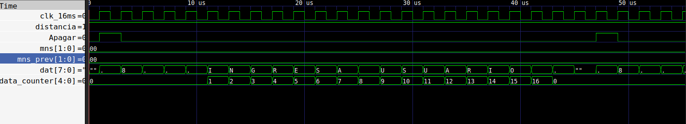
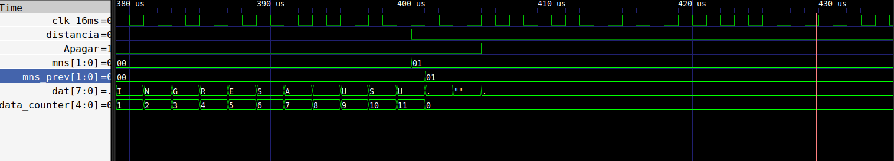
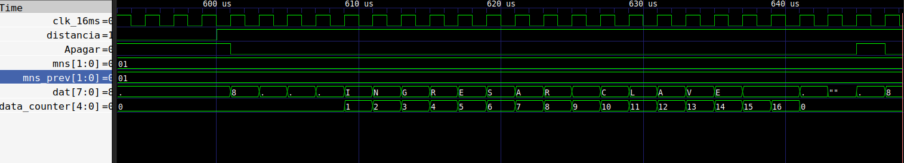

# Proyecto final - Electrónica Digital 1 - 2025-II

# Integrantes

- [Julian David Monsalve Sanchez](https://github.com/jumonsalves) 
- [Sofía Osejo Gallo](https://github.com/sosejo-UN)
- [Alejandro Pulido Sanchez](https://github.com/aljio)

# Nombre del proyecto

**Herm&Hest**

(Hermes, desde cualquier lugar del mundo, Hestia, brinda seguridad a su hogar)

Sistema electrónico para la gestión de entradas a hogares.

# Códigos

* [Teclado y pantalla](/src/teclado.v)
* [Ultrasonido y pantalla](/src/hcsr_04_distancia.v)
* [Protocolo uart](src/uart_lock_control.v)
* [Protocolo Uart](src/uart_rx.v)
* [Protocolo uart y servo](src/uart_servo.v)

# Documentación
## Descripción de la arquitectura

## Diagramas de la arquitectura

## Simulaciones

###
### Teclado

### Mensajes en la LCD

Para verificar el comportamiento del módulo [mensaje_Off_LCD](/src/mensaje_Off_LCD.v) se realizó el test bench [tb_mensaje_LCD](/src/tb_mensaje)

  

  

  

## Evidencias de implementación

