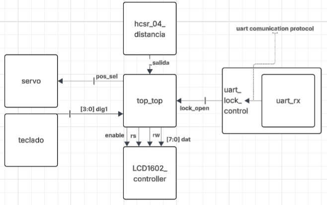
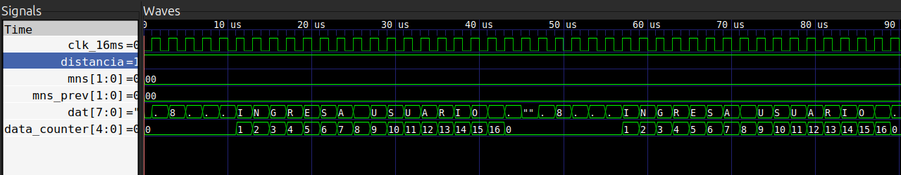
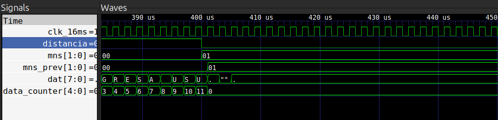
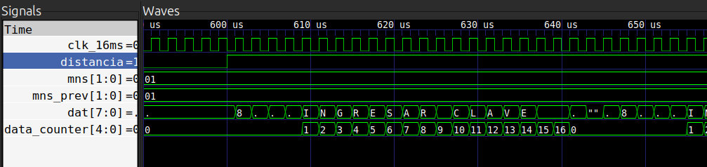

# Proyecto final - Electrónica Digital 1 - 2025-II

# Integrantes

- [Julian David Monsalve Sanchez](https://github.com/jumonsalves) 
- [Sofía Osejo Gallo](https://github.com/sosejo-UN)
- [Alejandro Pulido Sanchez](https://github.com/aljio)

# Nombre del proyecto

**Herm&Hest**

(Hermes, desde cualquier lugar del mundo, Hestia, brinda seguridad a su hogar)

Sistema electrónico para la gestión de entradas a hogares.

# Códigos

* [Teclado y pantalla](/proyecto/teclado.v)
* [Ultrasonido y pantalla](/proyecto/hcsr_04_distancia.v)
* [Protocolo UART receptor](proyecto/uart_lock_control.v)
* [Protocolo UART interpretar](proyecto/uart_rx.v)
* [Protocolo uart y servo](proyecto/uart_servo.v)

# Documentación
## Descripción de la arquitectura

De lo planteado, se logró implementar el sistema de apertura de la cerradura de forma remota por medio del protocolo UART

La comunicación inicia con el módulo uart_rx, encargado de recibir la información serial proveniente del pin RX siguiendo el protocolo UART estándar. Este módulo sincroniza la señal de entrada, detecta el bit de START, recibe los 8 bits de datos, detecta el bit de STOP y, una vez completado el proceso, entrega el byte recibido junto con una señal de dato válido. De esta manera, convierte la comunicación serial en datos que pueden ser usados por el resto del sistema.

El módulo “uart_lock_control” utiliza al receptor UART para interpretar los datos recibidos. Cada byte válido es comparado con códigos ASCII permitiendo controlar el estado de la cerradura. Cuando se recibe el carácter ‘A’, se envía la señal de abrir la cerradura, mientras que al recibir el carácter ‘C’ se envía la señal de cierre. El estado se mantiene hasta que llega un nuevo comando.

Finalmente, el módulo “uart_servo” actúa como top de este sistema. Toma la señal de cerrar o abrir generada por “uart_lock_control” y la utiliza para posicionar un servomotor mediante una señal Pulse Width Modulation (PWM), en 0° o 90° respectivamente. Además, este módulo incorpora el funcionamiento del buzzer, el cual se activa durante un intervalo de tiempo cada vez que se detecta un cambio en la posición del servo.

## Diagrama de la arquitectura

A continuación se describen gráficamente los módulos utilizados, indicando únicamente las señales que entran o salen de la FPGA hacia los periféricos, sin las señales que involucren el funcionamiento de los periféricos por separado.

  

## Simulaciones

### Mensajes en la LCD

Para verificar el comportamiento del módulo [mensaje_Off_LCD](/proyecto/mensaje_Off_LCD.v) se realizó el test bench [tb_mensaje_LCD](/proyecto/tb_mensaje_LCD.v). 

#### Módulo

Se realizó como primer acercamiento a lo que podría ser el cambio de mensaje y encendido/apagado de la LCD.  

Implementa el control de una pantalla LCD en modo de 8 bits, mostrando distintos mensajes según el estado del sistema. Utiliza una máquina de estados finitos (FSM) y un divisor de frecuencia (clock de 16ms).

El módulo recibe el reloj principal (clk), una señal de reinicio (reset), una señal de habilitación (ready_i), una señal de distancia (distancia) que simula la señal proveniente del sensor ultrasónico y una entrada de selección de mensaje (mns). Por medio de estas entradas se controla las señales rs, rw, enable y el bus de datos (dat) hacia la LCD.

La FSM tiene cinco estados :

- IDLE: Es el estado inicial. El sistema permanece aquí hasta que la señal ready_i pasa a alto.

- APAGADO: Apaga el display LCD mientras no hay apresencia de algo frente al sensor (distancia = 0).

- CONFIG_CMD: Envía la secuencia de comandos de configuración a la LCD.

- WR_TEXT: Escribe el mensaje en la LCD dependiendo del valor de mns.

- CHANGE_MNS: Detecta un cambio en el mensaje seleccionado, limpia la pantalla y prepara el sistema para escribir el nuevo texto.

El módulo almacena los mensajes en bancos de memoria, cada uno con 16 caracteres:

- Mensaje 0: “INGRESA USUARIO”
- Mensaje 1: “INGRESAR CLAVE”
- Mensaje 2: “ABIERTO...”
- Mensaje 3: “INTRUSO”

El sistema monitorea cambios en la señal mns para actualizar el texto que se visualiza en la LCD y en la señal distancia para prender o apagar la pantalla. 

### Test bench

El testbench genera un reloj y un reset para inicializar el sistema. Cada cierto tiempo genera cambios controlados en las señales distancia y mns. En la primera imagen se observa el inicio de la simulación donde distancia=1 (presencia detectada) y como mns=00, se muetsra el mensaje 0 en el display.

  

Luego, cuando distancia cambia a cero, se observa como ya no se muestra ningún mensaje porque la panatalla "está apagada": 

  

Finalmente, cuando distancia vuelve a ser 1, se empieza visualizar nuevamente el mensaje. Sin embargo, como hubo un cambio de mns antes de que la LCD se apagara, entonces ahora se visualiza el mns=1 que corresponde al mensaje 1:

  

## Evidencias de implementación

En esta sección se adjuntan videos de las pruebas que se realizaron con la LCD y el sensor de ultrasonido, como, los videos de las pruebas realizadas con el teclado matricial y la LCD.

